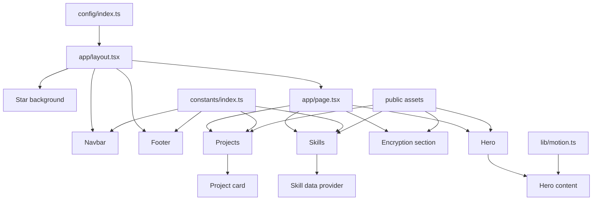

# Space Portfolio

An animated, responsive developer portfolio with a modern space-inspired interface. The project is designed around **Next.js 14**, **React**, **TypeScript**, **Tailwind CSS**, **Framer Motion**, and **Three.js**.

[](https://nextjs.org/)
[](https://react.dev/)
[](https://www.typescriptlang.org/)
[](https://tailwindcss.com/)
[](https://threejs.org/)

> [!IMPORTANT]
> **Repository status:** the current repository contains the project configuration and documentation, but the application source and static assets are not present. The expected `app/`, `components/`, `config/`, `constants/`, `lib/`, and `public/` directories must be restored before the development server, lint command, or production build can run. See [Troubleshooting](#troubleshooting) for details.

## Table of contents

- [Overview](#overview)
- [Features](#features)
- [Technology stack](#technology-stack)
- [Application architecture](#application-architecture)
- [Expected project structure](#expected-project-structure)
- [Getting started](#getting-started)
- [Available scripts](#available-scripts)
- [Customizing the portfolio](#customizing-the-portfolio)
- [Assets and media](#assets-and-media)
- [Quality checks](#quality-checks)
- [Performance and accessibility](#performance-and-accessibility)
- [Deployment](#deployment)
- [Troubleshooting](#troubleshooting)
- [Contributing](#contributing)
- [Security](#security)
- [License and attribution](#license-and-attribution)

## Overview

Space Portfolio is a single-page portfolio experience intended for developers, designers, and other technical professionals. It combines a dark cosmic visual style with animated content, a WebGL star field, video backgrounds, skill showcases, and project cards.

The page is organized into the following primary sections:

1. **Navigation** — anchor links, source-code link, and social profiles.
2. **Hero** — introduction, call to action, illustration, and black-hole video.
3. **Skills** — animated technology icons grouped by discipline.
4. **Performance and security** — an animated encryption-themed section.
5. **Projects** — responsive cards with images, descriptions, and external links.
6. **Footer** — community, social, contact, and informational links.

The portfolio is content-driven: most skills, projects, navigation links, social links, and footer links are intended to live in `constants/index.ts`, making common updates possible without restructuring components.

## Features

The intended application includes:

- **Responsive single-page layout** for desktop and mobile screens.
- **Next.js App Router** with shared metadata and layout components.
- **Animated hero content** powered by Framer Motion.
- **Interactive 3D star background** rendered with React Three Fiber and Drei.
- **Viewport-triggered animations** using `react-intersection-observer`.
- **Reusable, data-driven project cards** for portfolio work.
- **Categorized skill displays** for frontend, backend, full-stack, and other tools.
- **Mobile navigation menu** and smooth anchor navigation.
- **Optimized images** through the Next.js `Image` component.
- **Looping WebM backgrounds** for immersive visual sections.
- **Reusable Tailwind class composition** with `clsx` and `tailwind-merge`.
- **Strict TypeScript configuration** and Next.js ESLint rules.

## Technology stack

| Area | Technology | Purpose |
| --- | --- | --- |
| Framework | [Next.js 14](https://nextjs.org/) | App Router, rendering, routing, metadata, and image optimization |
| UI library | [React 18](https://react.dev/) | Component-based user interface |
| Language | [TypeScript](https://www.typescriptlang.org/) | Static typing and safer refactoring |
| Styling | [Tailwind CSS](https://tailwindcss.com/) | Utility-first responsive styling |
| Animation | [Framer Motion](https://www.framer.com/motion/) | Entrance and interaction animations |
| 3D rendering | [Three.js](https://threejs.org/) | WebGL rendering foundation |
| React 3D | [React Three Fiber](https://docs.pmnd.rs/react-three-fiber/) | React renderer for Three.js |
| 3D helpers | [Drei](https://github.com/pmndrs/drei) | Reusable React Three Fiber abstractions |
| Visibility tracking | [React Intersection Observer](https://github.com/thebuilder/react-intersection-observer) | Triggering animations as content enters the viewport |
| Icons | [Heroicons](https://heroicons.com/) and [React Icons](https://react-icons.github.io/react-icons/) | Interface and social icons |
| Class utilities | [`clsx`](https://github.com/lukeed/clsx) and [`tailwind-merge`](https://github.com/dcastil/tailwind-merge) | Conditional classes and Tailwind conflict resolution |
| Tooling | ESLint, PostCSS, and Autoprefixer | Code quality and CSS processing |

The exact installed versions are recorded in `package-lock.json`.

## Application architecture

The application follows a small component-and-data architecture:



### Rendering model

- `app/layout.tsx` defines global metadata, fonts, the page background, navigation, star canvas, and footer.
- `app/page.tsx` composes the portfolio sections.
- Components using browser APIs, React state, animation hooks, intersection observers, or WebGL are client components marked with `"use client"`.
- Static content is represented as typed arrays in `constants/index.ts` and mapped into reusable components.
- Images and videos are served from `public/` using root-relative URLs such as `/logo.png` and `/videos/blackhole.webm`.

## Expected project structure

The complete application is expected to use the following structure:

```text
space-portfolio/
├── app/
│   ├── favicon.ico
│   ├── globals.css
│   ├── layout.tsx
│   └── page.tsx
├── components/
│   ├── main/
│   │   ├── encryption.tsx
│   │   ├── footer.tsx
│   │   ├── hero.tsx
│   │   ├── navbar.tsx
│   │   ├── projects.tsx
│   │   ├── skills.tsx
│   │   └── star-background.tsx
│   └── sub/
│       ├── hero-content.tsx
│       ├── project-card.tsx
│       ├── skill-data-provider.tsx
│       └── skill-text.tsx
├── config/
│   └── index.ts
├── constants/
│   └── index.ts
├── lib/
│   ├── motion.ts
│   └── utils.ts
├── public/
│   ├── projects/
│   │   ├── project-1.png
│   │   ├── project-2.png
│   │   └── project-3.png
│   ├── skills/
│   │   └── ...technology icons
│   ├── videos/
│   │   ├── blackhole.webm
│   │   ├── encryption-bg.webm
│   │   └── skills-bg.webm
│   ├── hero-bg.svg
│   ├── lock-main.png
│   ├── lock-top.png
│   └── logo.png
├── .eslintrc.json
├── next.config.js
├── package.json
├── package-lock.json
├── postcss.config.js
├── tailwind.config.ts
└── tsconfig.json
```

## Getting started

### Prerequisites

Install the following tools before continuing:

- [Git](https://git-scm.com/)
- [Node.js](https://nodejs.org/) **18.17 or newer**
- npm, included with Node.js

Confirm your versions:

```bash
git --version
node --version
npm --version
```

### 1. Clone the repository

```bash
git clone https://github.com/gautam1426/space-portfolio.git
cd space-portfolio
```

### 2. Confirm that the application source is available

A Next.js project needs either an `app/` or `pages/` directory. For this project, verify that `app/page.tsx` exists:

```bash
test -f app/page.tsx && echo "Application source found"
```

If this command prints nothing or exits unsuccessfully, restore the missing source directories before continuing.

### 3. Install dependencies

Use the committed npm lockfile for a reproducible installation:

```bash
npm ci
```

For intentional dependency changes, use `npm install` and commit the resulting `package-lock.json` update.

> [!NOTE]
> Both `package-lock.json` and `yarn.lock` currently exist. Pick one package manager for a given workflow and avoid alternating between them, because doing so can produce different dependency trees. The commands in this README use npm.

### 4. Start the development server

```bash
npm run dev
```

Open [http://localhost:3000](http://localhost:3000) in a browser. Changes to application files should refresh automatically during development.

To use another port:

```bash
npm run dev -- --port 3001
```

### 5. Create a production build

```bash
npm run build
npm run start
```

The production server defaults to [http://localhost:3000](http://localhost:3000).

### Environment variables

The intended portfolio does not require environment variables for its static content. If external services are added later:

1. Create `.env.local` in the project root.
2. Prefix browser-visible variables with `NEXT_PUBLIC_` only when they are safe to expose.
3. Never commit secrets or `.env.local`.
4. Document every required variable without documenting its secret value.

Example:

```dotenv
NEXT_PUBLIC_SITE_URL=https://portfolio.example.com
```

## Available scripts

| Command | Description |
| --- | --- |
| `npm run dev` | Starts the Next.js development server with hot reloading |
| `npm run build` | Creates an optimized production build |
| `npm run start` | Serves a completed production build |
| `npm run lint` | Runs the Next.js ESLint checks |
| `npx tsc --noEmit` | Runs a standalone TypeScript type check |
| `npm audit` | Checks installed packages against known security advisories |

`npm run start` requires a successful `npm run build` first.

## Customizing the portfolio

After restoring the application source, replace all example content before publishing.

### Site metadata

Edit `config/index.ts` to update:

- Page title
- Description
- Search keywords
- Author name
- Author URL
- Social preview metadata, if added

Use a concise title and description that accurately represent the portfolio owner.

### Name and introduction

Update the placeholder name and introductory copy in:

- `components/main/navbar.tsx`
- `components/sub/hero-content.tsx`
- `components/main/footer.tsx`

Also connect the hero call-to-action to a meaningful section or external resource.

### Navigation and social links

Edit these exports in `constants/index.ts`:

- `NAV_LINKS` — in-page navigation items
- `SOCIALS` — social profiles shown in the navigation
- `FOOTER_DATA` — grouped footer and contact links
- `LINKS` — repository and other shared URLs

When opening external links in a new tab, retain `rel="noreferrer noopener"`.

### Skills

Skill content is divided into arrays in `constants/index.ts`:

- `SKILL_DATA`
- `FRONTEND_SKILL`
- `BACKEND_SKILL`
- `FULLSTACK_SKILL`
- `OTHER_SKILL`

Each item has a display name, image filename, width, and height. Add its matching image to `public/skills/`:

```ts
{
  skill_name: "TypeScript",
  image: "ts.png",
  width: 80,
  height: 80,
}
```

Avoid listing the same skill in multiple rows unless that repetition is intentional.

### Projects

Update the `PROJECTS` array in `constants/index.ts`:

```ts
{
  title: "Project title",
  description: "A concise explanation of the problem and solution.",
  image: "/projects/project-image.png",
  link: "https://project.example.com",
}
```

For every project:

- Use a real project or repository URL instead of `example.com`.
- Add a clear screenshot to `public/projects/`.
- Explain what the project does, your contribution, and the most relevant technologies.
- Keep image dimensions and aspect ratios consistent across cards.
- Use descriptive titles because they are also used as image alternative text.

### Theme and styling

The main visual system is controlled by:

- `app/globals.css` for global styles and custom utility classes
- `tailwind.config.ts` for Tailwind content scanning and theme extensions
- Component-level Tailwind classes for layout, typography, colors, and spacing

The base design uses a near-black purple background (`#030014`) with purple-to-cyan gradients. If you change the palette, check text contrast and hover/focus states throughout the page.

### Branding assets

Replace the following assets with your own optimized files:

- `public/logo.png`
- `public/hero-bg.svg`
- `app/favicon.ico`
- Project screenshots in `public/projects/`
- Skill icons in `public/skills/`

Preserve the filenames or update all matching references in the components.

## Assets and media

### Images

Use SVG for scalable illustrations and PNG/WebP/AVIF for raster content. Keep important image dimensions explicit when using `next/image` to prevent layout shifts.

Recommended practices:

- Compress screenshots before committing them.
- Remove unnecessary metadata from image files.
- Use descriptive `alt` text for meaningful images.
- Use empty alternative text only for genuinely decorative images.
- Do not upscale small source images.

### Videos

The design expects looping WebM files in `public/videos/`. Background videos should generally use:

- `muted`
- `autoPlay`
- `loop`
- `playsInline`
- A poster or visual fallback where practical

Keep videos short and aggressively compressed. Large background media can become the biggest contributor to page weight and loading time.

## Quality checks

Run the following checks before opening a pull request or deploying:

```bash
npm ci
npm run lint
npx tsc --noEmit
npm run build
npm audit
```

A change is ready for review when:

- ESLint reports no errors.
- TypeScript reports no type errors.
- The production build completes successfully.
- Navigation links reach the correct sections.
- External and contact links are valid.
- The layout works at mobile, tablet, and desktop widths.
- Images have useful alternative text.
- Animations do not obscure content or prevent interaction.
- The browser console has no unexpected warnings or errors.
- Known dependency advisories have been reviewed.

> [!WARNING]
> Do not apply `npm audit fix --force` without reviewing the proposed changes. It may upgrade Next.js or React across major versions and require application changes.

## Performance and accessibility

The 3D canvas, animated components, and background videos make performance testing especially important.

### Performance recommendations

- Test on both desktop and mid-range mobile devices.
- Lazy-load heavy sections when possible.
- Reduce video resolution and bitrate to the minimum acceptable quality.
- Avoid rendering more Three.js particles than the design needs.
- Respect device pixel ratio limits for the WebGL canvas.
- Keep client components focused; render static content on the server where possible.
- Run [Lighthouse](https://developer.chrome.com/docs/lighthouse/overview/) against a production build.

### Accessibility recommendations

- Keep heading levels in a logical order.
- Ensure every interactive element is reachable with a keyboard.
- Add visible focus styles to links and buttons.
- Give menu buttons accessible labels and state attributes such as `aria-expanded`.
- Verify text contrast against animated backgrounds.
- Respect `prefers-reduced-motion` and provide reduced-motion behavior.
- Do not rely on animation or color alone to communicate meaning.
- Test with browser zoom and at least one screen reader.

## Deployment

A successful local production build is the first deployment requirement:

```bash
npm run build
```

### Vercel

1. Push the repository to GitHub.
2. Import it from the [Vercel dashboard](https://vercel.com/new).
3. Select **Next.js** if framework detection does not select it automatically.
4. Keep the default build command, `npm run build`.
5. Add environment variables only if the application requires them.
6. Deploy and test all sections and static assets on the generated URL.

### Netlify

1. Import the repository into [Netlify](https://app.netlify.com/start).
2. Use `npm run build` as the build command.
3. Follow Netlify's current [Next.js deployment guide](https://docs.netlify.com/build/frameworks/framework-setup-guides/nextjs/).
4. Verify WebM files, image paths, and client-side WebGL behavior after deployment.

### Other Node.js hosts

For a conventional Node.js deployment:

```bash
npm ci
npm run build
npm run start
```

The host must provide a supported Node.js runtime and expose the port used by Next.js.

## Troubleshooting

### `Couldn't find any pages or app directory`

The application source is missing. Next.js requires an `app/` or `pages/` directory.

For this project, restore at least the expected source and asset directories:

```text
app/
components/
config/
constants/
lib/
public/
```

Then confirm that `app/layout.tsx` and `app/page.tsx` exist before rerunning the command. Installing dependencies cannot recreate these files.

### The build cannot find an image or video

- Confirm the file exists under `public/`.
- Match the filename's capitalization exactly; Linux deployments are case-sensitive.
- Reference public assets from the site root, for example `/projects/project-1.png`, not `public/projects/project-1.png`.
- Confirm that the media file is committed to Git.

### The star background does not render

- Check the browser console for WebGL errors.
- Confirm hardware acceleration and WebGL are enabled.
- Verify that `three`, `@react-three/fiber`, and `@react-three/drei` are installed at compatible versions.
- Make sure the canvas component is rendered as a client component.

### Background videos do not autoplay

Browsers usually require autoplay videos to be muted. Confirm the video uses `muted`, `playsInline`, `autoPlay`, and a supported codec. Test the deployed URL because browser behavior can differ from local development.

### Port 3000 is already in use

Start development on another port:

```bash
npm run dev -- --port 3001
```

### Dependency installation behaves inconsistently

- Use one package manager consistently.
- With npm, remove `node_modules` and run `npm ci` against the committed `package-lock.json`.
- Do not manually edit lockfiles.
- Check that your Node.js version meets the prerequisite.

## Contributing

Contributions are welcome. Before submitting a change:

1. Read [CONTRIBUTING.md](CONTRIBUTING.md).
2. Follow the [Code of Conduct](CODE_OF_CONDUCT.md).
3. Create a focused branch for the change.
4. Keep commits clear and scoped.
5. Run the checks in [Quality checks](#quality-checks).
6. Open a pull request explaining the motivation, implementation, and testing performed.
7. Include screenshots or a short recording for visible UI changes.

Good bug reports should include the operating system, Node.js version, browser, reproduction steps, expected behavior, actual behavior, and relevant console output.

## Security

Review [SECURITY.md](SECURITY.md) before reporting a vulnerability. Do not include secrets, private data, exploit details, or sensitive logs in a public issue.

Keep production dependencies maintained and review `npm audit` results regularly. Dependency updates—especially major upgrades of Next.js, React, Three.js, and React Three Fiber—should be tested with a complete production build and browser smoke test.

## License and attribution

The package metadata declares this project as **MIT licensed**, but this repository currently does not contain a root `LICENSE` file. Add the appropriate license text before distributing or accepting contributions so that reuse terms are explicit.

The design and project structure are based on the original [Space Portfolio](https://github.com/sanidhyy/space-portfolio) project by [Sanidhya Kumar Verma](https://github.com/sanidhyy). Retain all notices required by the upstream license when restoring or redistributing upstream source files and assets.

---

If this project helps you build your portfolio, consider starring the repository and sharing what you create.
